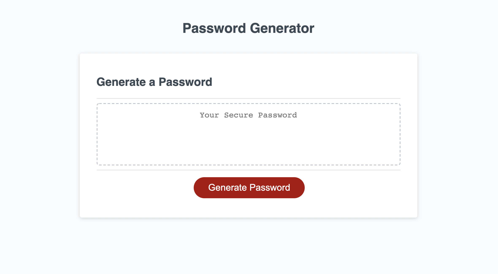

# Password Generator

Published: https://sygmo.github.io/password-generator/

For: UT Austin Coding Bootcamp

Technologies: JavaScript

# Summary

This app simply generates a secure password based on conditions selected by the user, such as whether to include capital letters, numbers, or special characters. HTML and CSS code was provided for this exercise. Only the function generatePassword() in the script.js file is my own work, but that function performs the main functionality of the app.

I plan to return to this project in the future to refactor the code. In particular, I'd like the user to be prompted on the page itself rather than through alerts. 